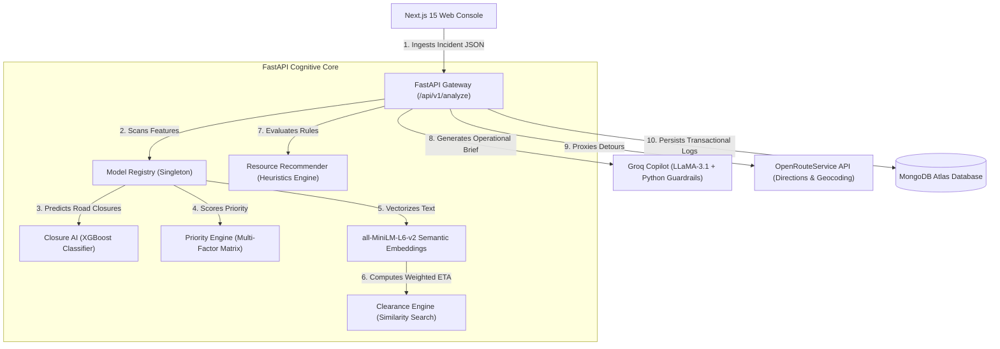

# 🚦 GRIDLOCK SENTINEL
### *Next-Generation AI Traffic Intelligence & Command-Center Orchestration Platform*

[](https://fastapi.tiangolo.com/)
[](https://nextjs.org/)
[](https://www.mongodb.com/)
[](https://groq.com/)
[](LICENSE)

GRIDLOCK SENTINEL is a backend-first, production-ready traffic decision support system built to manage **event-driven congestion** (such as political rallies, VIP processions, religious festivals, sports matches, construction tapers, and heavy vehicle breakdowns). By orchestrating real-time predictive models, semantic incident retrieval, dynamic routing, and guardrailed GenAI, the platform transforms raw incident reports into coordinated resource deployments and bypass routes in sub-seconds.

---

## 📖 Table of Contents
1. [Core Features & Innovation](#-core-features--innovation)
2. [Deep System Architecture](#-deep-system-architecture)
3. [The Core AI & Decision Engines](#-the-core-ai--decision-engines)
4. [Request & Response JSON Schemas](#-request--response-json-schemas)
5. [Database Schema & Automated Indexing](#-database-schema--automated-indexing)
6. [Folder-by-Folder Codebase Map](#-folder-by-folder-codebase-map)
7. [Comprehensive Setup & Run Guide](#-comprehensive-setup--run-guide)
8. [Production Cloud Deployment](#-production-cloud-deployment)
9. [Dashboard Screenshot Showcase](#-dashboard-screenshot-showcase)

---

## 🎯 Core Features & Innovation

* **Quantifiable Impact**: Replaces experience-driven guesswork with machine-learning-predicted road closures and weighted ETAs.
* **Coordinated Resource Dispatch**: Automatically calculates optimal requirements for officers, tow trucks, and ambulances, preventing both under- and over-deployment.
* **Safety-First GenAI**: Uses strict python-based regex guardrails to check LLM briefing scripts for factual consistency, eliminating hallucination risks in mission-critical environments.
* **Digital Twin Visualization**: Computes live alternative detours via OpenRouteService proxying and renders incident zones dynamically on Leaflet maps.

---

## 🏗️ Deep System Architecture

GRIDLOCK SENTINEL is built with a decoupled, high-performance architecture:



### Operational Pipeline Sequence
When an incident is reported, the backend runs the following pipeline asynchronously:
1. **Closure Prediction**: Runs `ClosureService` (XGBoost) using label encoders to flag physical blockage risks. If a critical hazard (like a tanker accident) is detected, it overrides the raw model and applies a safety floor probability of **0.72**.
2. **Priority Scoring**: Evaluates corridor, zone, and severity weights to calculate a priority rating.
3. **Semantic Retrieval**: Uses `all-MiniLM-L6-v2` embeddings to search the `retrieval_embeddings.pkl` matrix for historical similar events.
4. **Clearance ETA**: Calculates a weighted clearance average of retrieved matches, providing a data-backed duration forecast.
5. **Resource Recommendation**: Determines the exact deployment counts for personnel and equipment.
6. **Guardrailed Briefing**: Sends the verified context to Groq's LLaMA-3.1 to generate operator briefs. If the LLM generates numbers that contradict the core ML models, the guardrail rejects it and falls back to a deterministic text script.
7. **Database Persistence**: Stores all metrics in MongoDB Atlas, updating indexing patterns for future retrieval queries.

---

## 🧠 The Core AI & Decision Engines

### 1. Road Closure Prediction (`ClosureService`)
* **Model**: Trained XGBoost Classifier (`XGBClassifier`) loaded via singleton Model Registry.
* **Feature Vector**: processes 14 engineered features:
  * *Categorical*: `event_type`, `event_cause`, `corridor`, `junction`, `zone`, `police_station`, `veh_type`.
  * *Temporal*: `hour`, `weekday`, `month`, `is_weekend`, `is_peak` (8-10 AM, 5-8 PM).
  * *Spatial*: `latitude`, `longitude`.
  * *Aggregated*: `corridor_event_count`, `junction_event_count` and historical closure rates per corridor, zone, event type, and vehicle type computed dynamically from `retrieval_df.pkl`.
* **Label Encoding**: Programmatically maps categories via preloaded `closure_label_encoders.pkl`.
* **Operational Calibration Floor**: Machine learning models can under-predict low-frequency high-risk accidents due to class imbalances. If the incident severity is marked `"critical"`, high-risk (accident/collision), and involves hazardous vehicles (tanker, fuel, hazmat) or major junctions, the system overrides raw probabilities to enforce a floor confidence of **0.72**, guaranteeing a road closure recommendation to dispatchers.

### 2. Incident Priority Scoring (`PriorityService`)
Calculates a unified severity rating between `0.0` and `1.0` using a multi-factor weighting matrix:
$$\text{Priority Score} = (0.35 \times \text{Event Weight}) + (0.25 \times \text{Corridor Weight}) + (0.25 \times \text{Zone Weight}) + (0.15 \times \text{Severity Weight})$$
* **Event Weights**: e.g., Fire (0.90), Accident (0.85), Water Logging (0.82), Construction (0.62), Breakdown (0.52).
* **Corridor & Zone Lookup**: Read from `corridor_priority_lookup.pkl` and `zone_priority_lookup.pkl` (e.g. Critical corridors like Outer Ring Road receive higher weights).
* **Classification Thresholds**:
  * Score $\ge 0.78 \rightarrow$ **Critical**
  * Score $\ge 0.62 \rightarrow$ **High**
  * Score $\ge 0.42 \rightarrow$ **Medium**
  * Score $< 0.42 \rightarrow$ **Low**

### 3. Semantic Similarity Search (`RetrievalService`)
* **Embedding Model**: Local SentenceTransformers library (`all-MiniLM-L6-v2`) vectorizes unstructured incident text descriptions into 384-dimensional dense vectors.
* **Hybrid Key Pre-Filtering**: Filters candidate databases using `hybrid_key = f"{event_category}_{event_cause}"` (e.g. `unplanned_accident` or `planned_procession`). This limits calculations to contextually identical records.
* **Cosine Similarity**: Compares the query vector against the filtered matrix in `retrieval_embeddings.pkl` to fetch the top 5 nearest historical incidents.
* **FAISS Indexing**: In high-scale settings, setting `USE_FAISS_RETRIEVAL=true` swaps cosine similarity for preloaded flat index search engines stored in `backend/assets/closure/faiss_indexes/*.index`.

### 4. Clearance ETA Estimation (`ClearanceService`)
* **Mathematical Model**: Computes a similarity-weighted average of the clearance durations of retrieved events, ensuring that more textually/conceptually similar historical events contribute more to the estimate:
  $$\text{Clearance Minutes} = \frac{\sum (\text{Clearance Time}_i \times \text{Similarity Score}_i)}{\sum \text{Similarity Score}_i}$$
* **Fallback Rules**: If no similar events are found in history, it falls back to deterministic rule estimates (70 minutes for severe accidents, fire, or flooding; 35 minutes for others) at a baseline confidence of 0.48.

### 5. Dynamic Resource Recommendation (`ResourceService`)
Calculates exact personnel and asset requirements based on priority scores, medical risks, and vehicle types:
* **Traffic Officers**: Recommends 1 (low priority) up to 5 (critical closures) to establish tape boundaries.
* **Tow Trucks**: Guaranteed deployment ($\ge 1$) for heavy vehicle issues/breakdowns/accidents to clear lanes, scaling up to 2 if the clearance estimate exceeds 60 minutes.
* **Ambulance Units**: Guaranteed deployment ($\ge 1$) if the incident description triggers keywords like "injury", "fatal", "fire", or "crash" and severity is critical.
* **Operational Directives**: Automatically populates checklists (e.g., alert civic sewage pumps for water logging; verify taper lengths for work-zones).

### 6. GenAI RAG Copilot with Grounding Guardrails (`CopilotService`)
* **Prompt Engineering**: Groq's LLaMA-3.1 JSON mode is provided with a compact, structured context block containing the exact output of our ML models (expected closure, priority levels, and exact resource numbers).
* **Deterministic Python Guardrails**: To prevent GenAI hallucinations in mission-critical networks, a python method scans the LLM output using regular expressions:
  * Verifies that the LLM-briefed priority level matches the model output.
  * Verifies that the LLM-briefed officer, tow truck, traffic unit, and ambulance counts match the model recommendations.
  * Verifies that the LLM-briefed clearance time is within a $25\%$ tolerance of the calculated ETA.
* **Failsafe Fallback**: If the LLM brief fails any validation check, it is discarded and the system falls back to a deterministic, pre-validated operational brief template computed by python, ensuring 100% safe operations.

---

## 📊 Request & Response JSON Schemas

### Incident Ingestion (`POST /api/v1/analyze`)
This endpoint accepts raw reports and executes the full predictive pipeline:

#### Request Body
```json
{
  "event_type": "accident",
  "corridor": "ORR East 1",
  "zone": "East Zone",
  "description": "Fuel tanker collision causing severe congestion near Marathahalli junction",
  "severity": "critical",
  "metadata": {
    "event_category": "unplanned",
    "latitude": 12.9562,
    "longitude": 77.7011
  }
}
```

#### Response Body
```json
{
  "incident_id": "60c72b2f9b1d8e2a4c8b4567",
  "closure_prediction": {
    "closure_required": true,
    "confidence": 0.72,
    "model_version": "Closure Prediction V2"
  },
  "priority": {
    "priority_level": "critical",
    "priority_score": 0.865,
    "factors": {
      "event": 0.85,
      "corridor": 0.78,
      "zone": 0.92,
      "severity": 0.95
    }
  },
  "clearance": {
    "estimated_minutes": 46.7,
    "confidence": 0.892,
    "basis": "retrieval"
  },
  "resources": {
    "officers": 5,
    "tow_trucks": 1,
    "traffic_units": 3,
    "ambulance_units": 2,
    "officer_requirement": "4-6 Officers",
    "tow_truck_requirement": "1 Tow Truck",
    "traffic_unit_requirement": "3 Traffic Units",
    "ambulance_requirement": "2 Ambulances",
    "resource_level": "High Resource Requirement",
    "summary": "4-6 Officers, 1 Tow Truck, High Resource Requirement",
    "rationale": [
      "Priority is critical with score 0.865.",
      "Estimated clearance is 46.7 minutes based on retrieval.",
      "Event type 'accident' drives vehicle recovery planning."
    ],
    "notes": [
      "Create diversion plan for affected corridor",
      "Notify control room and zone supervisor",
      "Stage resources near nearest junction"
    ]
  },
  "similar_incidents": [
    {
      "similar_incident_id": "hist_accident_042",
      "similarity_score": 0.915,
      "clearance_time": 45.0,
      "historical_outcome": "resolved",
      "event_cause": "accident",
      "corridor": "ORR East 1",
      "zone": "East Zone",
      "outcome": "resolved"
    }
  ],
  "causes": [
    "Historical pattern: 42 similar 'accident' events in the knowledge base",
    "High-priority ratio for this cause: 0.785",
    "Median historical clearance for this cause: 48.0 minutes"
  ],
  "recommended_actions": [
    "Validate incident from field unit or CCTV",
    "Broadcast ETA and diversion advisory",
    "Activate corridor-level response protocol",
    "Escalate to command center",
    "Dispatch tow and medical support before full closure decision"
  ],
  "copilot_summary": {
    "mode": "groq_grounded_rag",
    "model": "llama-3.1-8b-instant",
    "llm_status": "accepted",
    "llm_brief": {
      "incident_summary": "Critical accident reported on ORR East 1 involving a fuel tanker.",
      "risk_assessment": "Priority: Critical. Road closure is required with high probability due to hazardous cargo.",
      "resource_explanation": "Deploying 5 officers, 1 tow truck, 3 traffic units, and 2 ambulances to secure the junction.",
      "historical_context": "Review of similar accidents indicates median clearance is 45 minutes.",
      "commander_recommendation": "Hold normal flow on ORR East 1, activate diversion plans immediately, and dispatch heavy recovery."
    }
  }
}
```

---

## 💾 Database Schema & Automated Indexing

GRIDLOCK SENTINEL uses **MongoDB Atlas** for transactional log storage. Database collection indexes are generated automatically on startup by the `ensure_indexes` method in `MongoDatabase`:

* **`incidents` collection**:
  * `created_at` (Descending): Powers the live incident feed on the dashboard.
  * `event_type` (Ascending), `corridor` (Ascending), `zone` (Ascending): Enables quick search filtering and heatmap generation.
* **`predictions` collection**:
  * `incident_id` (Ascending): Links prediction audits to parent incidents.
* **`similar_incidents` collection**:
  * `incident_id` (Ascending): Stretches linkages to historical matches for learning audits.
* **`analytics` collection**:
  * Unique compound index on `("date", ASCENDING), ("zone", ASCENDING)`: Speeds up dashboard stats without duplicate entries.
* **`users` collection**:
  * Unique sparse index on `email`.

---

## 📂 Folder-by-Folder Codebase Map

* **`backend/`**: Asynchronous FastAPI core.
  * `app/api/routes/`: Router directories. Includes `analyze.py` (primary pipeline), `copilot.py` (briefing), `debug.py` (model audits), and `ors.py` (OpenRouteService proxy).
  * `app/core/`: Application settings, log configs, cache utilities, and the singleton `ModelRegistry` loader.
  * `app/database/`: Async motor connection clients and collection repository query modules.
  * `app/middleware/`: CORS middleware settings and Request ID logging middleware.
  * `app/services/`: Core logic: `closure_service.py` (XGBoost + calibration), `retrieval_service.py` (all-MiniLM-L6-v2 + FAISS), `clearance_service.py` (weighted averages), `resource_service.py` (dispatch heuristics), and `copilot_service.py` (RAG + regex guardrails).
  * `assets/`: Model binaries, lookup tables, embeddings matrix, and serialized knowledge bases.
* **`frontend/`**: Next.js 15 Web Console.
  * `app/`: Next.js App Router layouts, styles, and page layouts.
  * `components/`: UI components, including the React Leaflet Map container and animated dashboards.
  * `services/`: Client-side fetching functions (`analyze.ts`, `openrouteservice.ts`).
  * `stores/`: Zustand client-side stores: `incidentStore.ts` (pipeline stage loading states), `mapStore.ts` (routing and layers), and `dashboardStore.ts` (analytics and KPIs).
* **`docs/`**: blueprints and logs.
  * `architecture/`: Backend architecture diagrams and system walkthrough summaries.
  * `api_docs/`: Endpoint request payloads, startup verifications, and model loading outputs.

---

## 🛠️ Comprehensive Setup & Run Guide

### Prerequisite Checklist
* Python 3.11.x (Add to PATH)
* Node.js v18.x or higher
* Git installed

### 1. Run the FastAPI Backend
Open your terminal (PowerShell or CMD) and run:
```powershell
# Navigate to the backend directory
cd backend

# Create your virtual environment (recommended)
py -3.11 -m venv venv

# Activate the virtual environment
.\venv\Scripts\activate

# Install the Python dependencies
pip install -r requirements.txt

# Run the FastAPI development server
uvicorn app.main:app --reload --port 8000
```
* **Swagger UI Documentation**: Navigate to `http://localhost:8000/docs` to test endpoints interactively.

### 2. Run the Next.js Frontend
Open a **second, separate** terminal window and run:
```powershell
# Navigate to the frontend directory
cd frontend

# Install Node dependencies
npm install

# Start the Next.js development server
npm run dev
```
* The Next.js dashboard console will start running at: `http://localhost:3000`

---

## 🚀 Production Cloud Deployment

### 1. Backend: Deploy to Hugging Face Spaces (16GB RAM for Free)
Because loading PyTorch and Sentence-Transformers requires significant memory, standard free tiers (like Render's free tier offering 512MB RAM) will crash with Out Of Memory (OOM) errors. 

Hugging Face Spaces provides a Docker environment with **16GB of RAM and 2 vCPUs for free**:
1. Create a free account on [Hugging Face](https://huggingface.co/).
2. Create a new Space, select **Docker** as the SDK, and choose **Blank**.
3. Upload your `backend` directory contents (including `Dockerfile`, `app/`, `assets/`, and `requirements.txt`).
4. In Space Settings, add your environment variables:
   * `MONGODB_URI` = Your MongoDB Atlas string.
   * `GROQ_API_KEY` = Your Groq LLaMA-3.1 API key.
   * `ORS_API_KEY` = Your OpenRouteService API key.
   * `ALLOW_DEGRADED_MODE` = `true` (gracefully degrades if local Redis is offline).
   * `USE_FAISS_RETRIEVAL` = `false` (uses the highly compatible Cosine similarity path).
5. The container will build automatically and expose a free public API URL.

### 2. Frontend: Deploy to Vercel
1. Import your GitHub repository into **Vercel** (100% free for frontend hosting).
2. Add the environment variable:
   * `NEXT_PUBLIC_API_BASE_URL` = Your Hugging Face Space API URL.
3. Click **Deploy**.

---

## 💻 Dashboard Screenshot Showcase

The `frontend` folder contains five screenshots showing the visual dashboard design and user workflows:

1. **`image.png` & `image-1.png` (Main Analytics Dashboard)**: 
   * Represents the command center landing page. 
   * Highlights key operational metrics, including zone risk levels, corridor traffic speed trends, live incident lists, and resource allocation statuses.
2. **`image-2.png` (Operator Incident Intake Console)**:
   * Displays the reporting form used by operators.
   * Includes fields for selecting the event type, corridor location, zone, severity, and typing the raw description. Operates with an interactive Leaflet map to capture coordinates.
3. **`image-3.png` (Digital Twin & Routing View)**:
   * Illustrates the dynamic routing detour maps.
   * Shows a red highlighted corridor segment representing the active closure zone, and green alternative route paths calculated via OpenRouteService to bypass the gridlock.
4. **`image-4.png` (AI Copilot Decision Support Panel)**:
   * Displays the AI recommendations card side-by-side with the incident details.
   * Renders predicted road closure confidence bars, priority levels, estimated clearance minutes, required officer/tow truck counts, and the guardrailed AI commander brief text.
