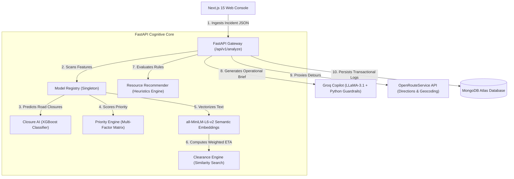

# 🚦 GRIDLOCK SENTINEL

### *AI-Powered Traffic Intelligence & Command-Center Orchestrator*

GRIDLOCK SENTINEL is a production-ready, backend-first decision support platform designed to mitigate **event-driven congestion** (such as political rallies, festivals, sports games, construction tapers, and heavy vehicle breakdowns). By orchestrating real-time predictive models, semantic incident retrieval, dynamic routing, and guardrailed GenAI, the platform transforms raw incident reports into coordinated resource deployments and bypass routes in sub-seconds.

---

## 🎯 Core Value Proposition

* **Quantifiable Impact**: Replaces experience-driven guesswork with machine-learning-predicted road closures and weighted ETAs.
* **Coordinated Resource Dispatch**: Automatically calculates optimal requirements for officers, tow trucks, and ambulances, preventing both under- and over-deployment.
* **Safety-First GenAI**: Uses strict python-based regex guardrails to check LLM briefing scripts for factual consistency, eliminating hallucination risks in mission-critical environments.
* **Digital Twin Visualization**: Computes live alternative detours via OpenRouteService proxying and renders incident zones dynamically on Leaflet maps.

---

## 🏗️ System Architecture & Data Flow

GRIDLOCK SENTINEL is built with a decoupled, high-performance architecture:



### Operational Pipeline Sequence
When an incident is reported, the backend runs the following pipeline asynchronously:
1. **Closure Prediction**: Runs `ClosureService` (XGBoost) using label encoders to flag physical blockage risks. If a critical hazard (like a tanker accident) is detected, it overrides the raw model and applies a safety floor probability of **0.72**.
2. **Priority Scoring**: Evaluates corridor, zone, and severity weights to calculate a priority rating.
3. **Semantic Retrieval**: Uses `all-MiniLM-L6-v2` embeddings to search the `retrieval_embeddings.pkl` matrix for historical similar events.
4. **Clearance ETA**: Calculates a weighted clearance average of retrieved matches, providing a data-backed duration forecast.
5. **Resource Recommendation**: Determines the exact deployment counts for personnel and equipment.
6. **Guardrailed Briefing**: Sends the verified context to Groq's LLaMA-3.1 to generate operator briefs. If the LLM generates numbers that contradict the core ML models, the guardrail rejects it and falls back to a deterministic text script.
7. **Database Persistence**: Stores all metrics in MongoDB Atlas, updating indexing patterns for future retrieval queries.

---

## 📂 Codebase Navigation Map

```text
GRIDLOCK/
├── backend/                       # Python FastAPI Backend
│   ├── app/
│   │   ├── api/routes/            # API Router endpoints (analyze, copilot, ors proxy)
│   │   ├── core/                  # Core configurations, logging, and singleton model registry
│   │   ├── database/              # Async MongoDB client driver and transactional indices
│   │   ├── middleware/            # Request ID, rate limiting, and CORS headers
│   │   ├── services/              # ML processing, semantic retrieval, and resource rules
│   │   └── main.py                # FastAPI Application lifespan and router setup
│   ├── assets/                    # Preloaded pickle metadata, label encoders, and weights
│   ├── tests/                     # pytest simulation suite
│   ├── Dockerfile                 # Docker container builder configuration
│   └── requirements.txt           # Python dependency listings (PyTorch, XGBoost, FAISS)
│
├── frontend/                      # Next.js Web Console (Dashboard Platform)
│   ├── app/                       # App Router pages and client layouts
│   ├── components/                # Reusable UI controls and map wrappers
│   ├── features/                  # UI features (command center panels, heatmaps, forms)
│   ├── services/                  # API endpoints integrations (analyze, openrouteservice)
│   └── stores/                    # Zustand client state stores (incidentStore, mapStore)
│
└── docs/                          # Architecture blueprints and system testing logs
```

---

## 💻 Dashboard Screenshot Showcase

The `frontend` folder contains five screenshots showing the visual dashboard design and user workflows:

1. **`image.png` & `image-1.png` (Main Analytics Dashboard)**: 
   * Represents the command center landing page. 
   * Highlights key operational metrics, including zone risk levels, corridor traffic speed trends, live incident lists, and resource allocation statuses.
2. **`image-2.png` (Operator Incident Intake Console)**:
   * Displays the reporting form used by operators.
   * Includes fields for selecting the event type, corridor location, zone, severity, and typing the raw description. Operates with an interactive Leaflet map to capture coordinates.
3. **`image-3.png` (Digital Twin & Routing View)**:
   * Illustrates the dynamic routing detour maps.
   * Shows a red highlighted corridor segment representing the active closure zone, and green alternative route paths calculated via OpenRouteService to bypass the gridlock.
4. **`image-4.png` (AI Copilot Decision Support Panel)**:
   * Displays the AI recommendations card side-by-side with the incident details.
   * Renders predicted road closure confidence bars, priority levels, estimated clearance minutes, required officer/tow truck counts, and the guardrailed AI commander brief text.

---

## 🛠️ Local Installation & Running Guide

### 1. Run the FastAPI Backend
Ensure Python 3.11 is installed, then open your terminal:
```bash
cd backend
# Create and activate a virtual environment
py -3.11 -m venv venv
.\venv\Scripts\activate

# Install requirements
pip install -r requirements.txt

# Run the app
uvicorn app.main:app --reload --port 8000
```
* Interactive API Swagger docs are available at: `http://localhost:8000/docs`

### 2. Run the Next.js Frontend
Ensure Node.js is installed, then open a second terminal:
```bash
cd frontend
# Install dependencies
npm install

# Start the dev server
npm run dev
```
* Open the browser console at: `http://localhost:3000`

---

## 🚀 Production Cloud Deployment

### 1. Backend: Deploy to Hugging Face Spaces (Recommended Free Option)
Because loading PyTorch, Sentence-Transformers, and XGBoost requires significant memory, standard free cloud tiers (like Render Free which offers 512MB RAM) will crash with Out Of Memory (OOM) errors. 

**Hugging Face Spaces** provides a Docker container host with **16GB RAM and 2 vCPUs for free**:
1. Create a free Hugging Face account and choose **Create a new Space**.
2. Select **Docker** as the SDK and choose **Blank**.
3. Upload your `backend` directory contents (including `Dockerfile`, `app`, `assets`, and `requirements.txt`).
4. In Space Settings, add your secrets (environment variables):
   * `MONGODB_URI` = Your MongoDB Atlas string.
   * `GROQ_API_KEY` = Your Groq LLaMA-3.1 API key.
   * `ORS_API_KEY` = Your OpenRouteService API key.
   * `ALLOW_DEGRADED_MODE` = `true`
5. The container will build automatically and expose a free public URL.

### 2. Frontend: Deploy to Vercel
1. Import your GitHub repository into **Vercel** (100% free for frontends).
2. Add the environment variable:
   * `NEXT_PUBLIC_API_BASE_URL` = Your Hugging Face Space API URL.
3. Click **Deploy**.

---

## 📜 License
Developed for educational, research, and hackathon demonstration purposes under the MIT License.
